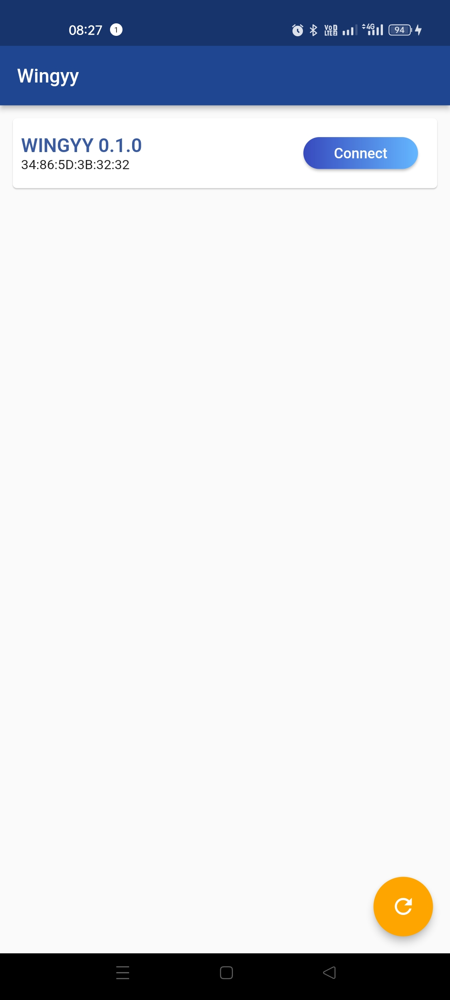

# Wingyy

Wingyy is a BLE device to control motor, read Air pressure and temperature, post data over BLE to read by a Mobile device.

### Client: Oleg Kuybeda, IP Solutions.

### Date of Start: Sep 19, 2022

### Date of Completion: On Going

## Requirements:

1. Hardware development based on ESP32 as main microcontroller
2. BoM Creation
3. PCB Layout and generation of DFM files
4. Firmware development
5. Mobile app with Flutter Framework
6. Battery backup with Hot swap

## Tools used:

1. KiCAD 6 – for PCB layout design
2. ESP-IDF – for firmware development
3. Flutter – for mobile app development

## Client’s Testimonial:

## Demo Video

### Breadboard Model

### Mobile App Demo

### Mobile App Screenshots

### PCB Layout

